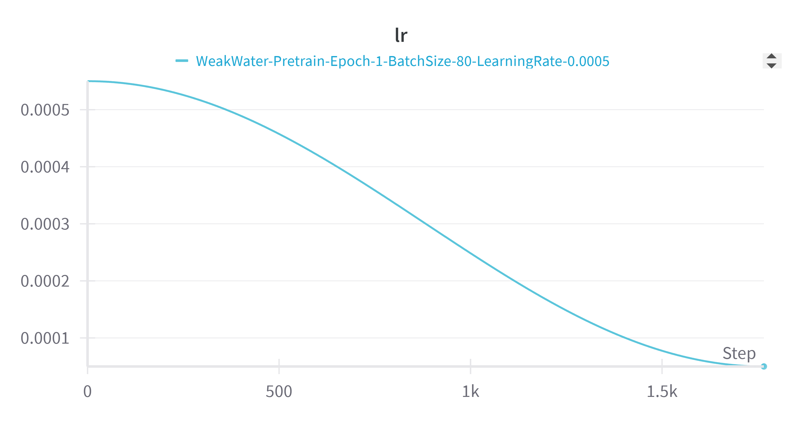
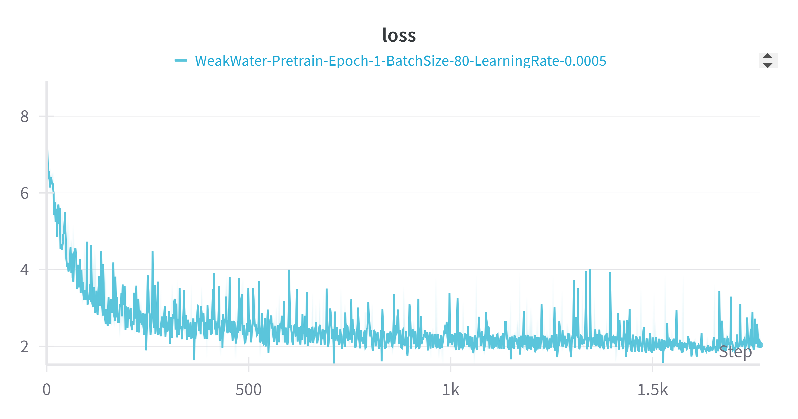
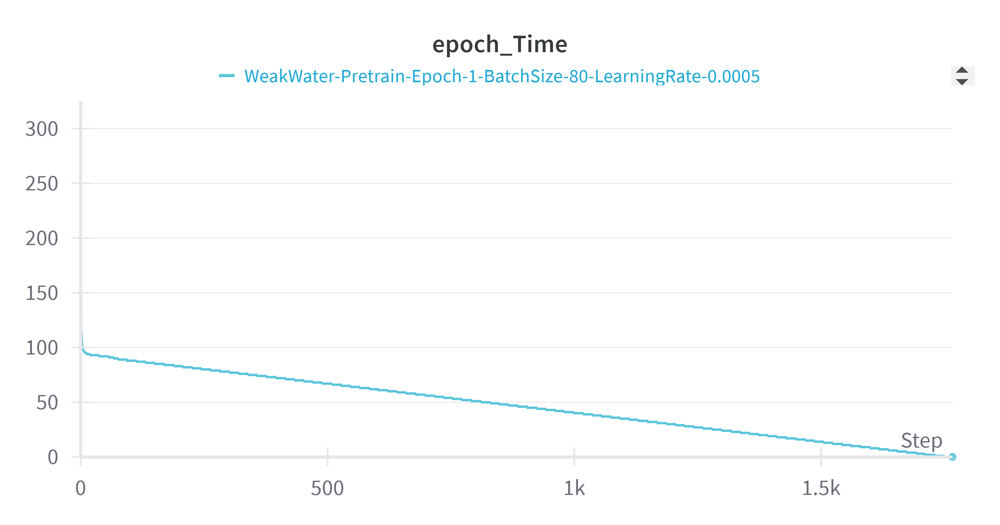
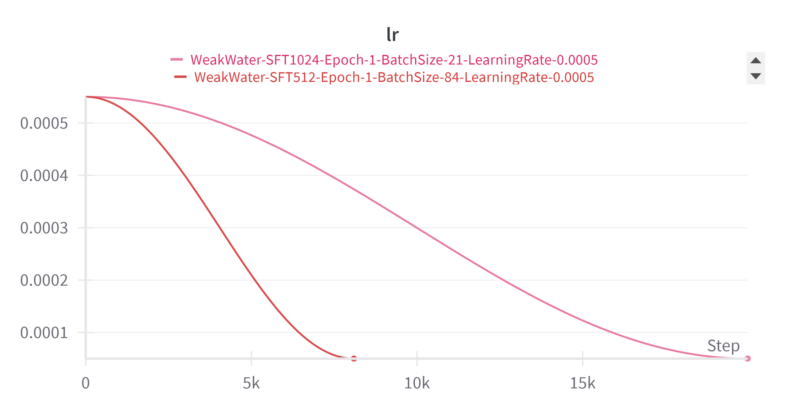
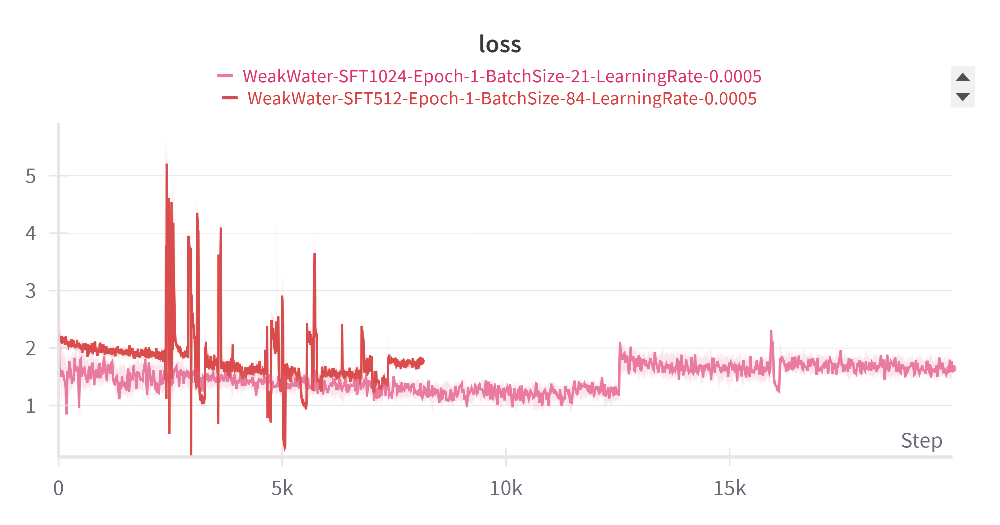
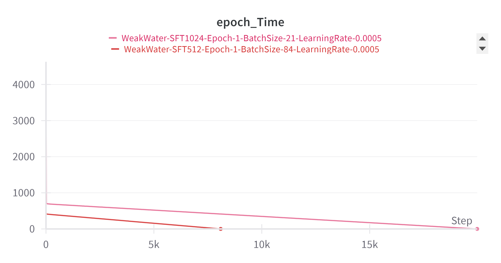
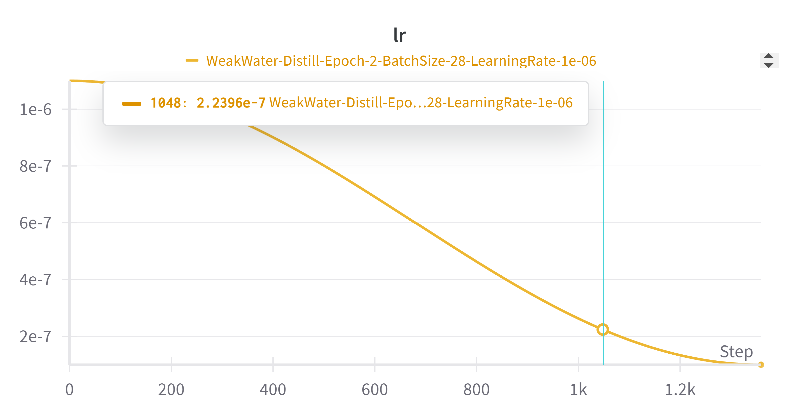
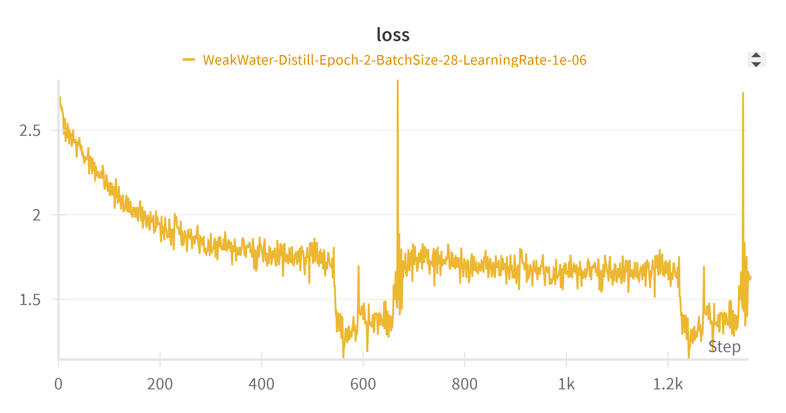
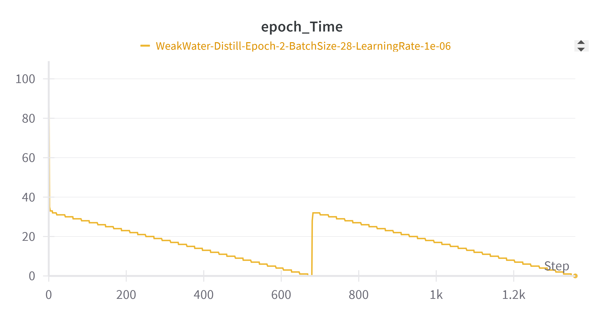

# WeakWater-30M

WeakWater-30M 是一个从零开始构建的千万参数大规模预训练语言模型，涵盖预训练（Pretrain）、有监督微调（SFT）和 R1 推理蒸馏三个阶段。该项目旨在探索小规模模型在具备流畅问答与链式思维能力方面的潜力，适用于多任务学习及复杂 AI 应用场景。

------

## 项目简介

WeakWater-30M 项目从零开始实现了一个基于 Transformer 解码器的预训练语言模型。项目中我们设计了类 LLaMA3 的模型结构，结合了 RMSNorm、旋转位置编码 (RoPE)、分组注意力机制和 SwiGLU 激活函数，从而在千万参数级别上实现了较高的生成和推理能力。项目不仅关注预训练阶段，还包括后续的有监督微调（SFT）以及针对“思维链”格式的 R1 推理蒸馏，最终构建出一个既具备问答能力又能生成推理步骤的多任务模型。

------

## 项目特点

- **从零构建模型**：自定义模型配置、前向传播、损失计算等各个环节，深入理解大模型的内部原理。

- **高效分词器**：使用 Byte-Level BPE 分词器，词汇表大小为 6400，良好的中文支持与压缩率。

- 三阶段训练

  ：

  - **预训练**：利用大规模文本数据训练自回归语言模型。
  - **有监督微调（SFT）**：在指令对话数据上进行微调，强化模型的指令遵循能力。
  - **R1 推理蒸馏**：采用带有思维链格式的蒸馏数据，提升模型复杂问题推理的透明度和准确性。

- **高效训练策略**：支持混合精度训练、梯度累积等技术，在单 GPU（如 RTX 4090）上也可完成高效训练。

- **灵活部署**：模型参数较小，便于后续量化和嵌入式设备部署。

------

## 环境要求

- Python 3.12
- PyTorch >= 2.5.1 + CUDA 支持（建议使用 4090 或同等级 GPU）
- Transformers >= 4.49.0
- tokenizers
- (可选) wandb 用于训练日志追踪

建议使用支持自动混合精度（AMP）的 GPU 环境，若用于分布式训练请确保配置正确。

------

## 安装步骤

1. **克隆仓库**

   ```bash
   git clone https://github.com/Breeze648/WeakWaterb-30M.git
   cd WeakWater-30M
   ```

2. **创建虚拟环境并安装依赖**

   ```bash
   python -m venv venv
   source venv/bin/activate   # Linux/Mac
   venv\Scripts\activate      # Windows
   
   pip install -r requirements.txt
   ```

   > 如果没有 `requirements.txt` 文件，可手动安装：
   >
   > ```bash
   > pip install torch torchvision torchaudio
   > pip install transformers tokenizers
   > pip install wandb  # 可选
   > ```

3. **下载必要的数据集**

   - 预训练数据：运行命令

     ```bash
     modelscope download --dataset Harris/pretrain pretrain.jsonl --local_dir ./
     ```

   - SFT 数据：

     ```bash
     modelscope download --dataset Harris/pretrain sft_512.jsonl --local_dir ./
     ```

   - 长文 SFT 数据（可选）：

     ```bash
     modelscope download --dataset Harris/pretrain sft_1024.jsonl --local_dir ./
     ```

   - R1 蒸馏数据：

     ```bash
     modelscope download --dataset Harris/pretrain r1_1024.jsonl --local_dir ./
     ```

------

## 数据准备

项目使用的原始数据格式为 JSONL，每行一个 JSON 对象。预训练数据仅包含 "text" 字段；SFT 和 R1 数据则包含 "conversations" 数组（其中用户和助手的对话通过 `role` 和 `content` 标记）。

分词器训练脚本 `train_tokenizer.py` 会读取预训练数据训练 Byte-Level BPE 模型，并生成相应的 `WeakWater_tokenizer` 文件夹，其中包含 `tokenizer.json` 和其他必要的配置文件。运行分词器训练：

```bash
python train_tokenizer.py
```

------

## 训练流程

### 预训练

- **文件**：`pretrain.py`

- 主要步骤

  ：

  - 初始化 WeakWater 模型（基于自定义 LLMConfig）
  - 加载预训练数据集 `pretrain.jsonl`
  - 使用交叉熵损失进行自回归训练
  - 采用梯度累积和自动混合精度 (AMP)
  - 定时保存训练 checkpoint

运行预训练示例：

```bash
python pretrain.py --data_path pretrain.jsonl --epochs 1 --batch_size 80
```

### 有监督微调 (SFT)

- **文件**：`SFT.py`

- 主要步骤

  ：

  - 基于预训练模型加载权重
  - 加载 SFT 数据集（格式化后的对话数据）
  - 利用定制的 loss mask 仅对助手回答部分计算损失
  - 分阶段训练：先用 512 序列，再用 1024 序列扩展上下文能力

运行 SFT 示例：

```bash
python SFT.py --data_path sft_512.jsonl --epochs 1 --batch_size 84
```

### R1 推理蒸馏

- **文件**：`distill.py`

- 主要步骤

  ：

  - 基于 SFT 模型作为初始化权重
  - 加载 R1 蒸馏数据集，数据中包含 `<think>` 和 `<answer>` 标签的思维链格式
  - 对特定 token（如 `<think>` 等）施加额外损失惩罚，鼓励模型学习推理过程
  - 微调后生成具备慢思考能力的模型

运行 R1 蒸馏示例：

```bash
python distill.py --data_path r1_1024.jsonl --epochs 2 --batch_size 28 --learning_rate 1e-6
```

------

## 推理与评测

- **文件**：`eval_model.py`

- **说明**：加载指定阶段的模型权重（预训练、SFT 或蒸馏），支持交互式对话测试。

- 使用方法

  ：

  ```bash
  # 预训练模型推理：
  python eval_model.py --model_mode 0
  # SFT 模型推理：
  python eval_model.py --model_mode 1
  # 蒸馏模型推理：
  python eval_model.py --model_mode 2
  ```

在交互式界面输入对话文本，模型将实时生成回复，支持 Top-p 采样与温度调节。

------

## 项目结构

```
SpongeBob-30M/
├── Config.py            # 模型配置
├── model.py             # 模型架构及前向传播
├── dataset.py           # 数据集加载（预训练 & SFT）
├── train_tokenizer.py   # 分词器训练脚本
├── pretrain.py          # 预训练主流程
├── SFT.py               # 有监督微调（SFT）流程
├── distill.py           # R1 推理蒸馏流程
├── eval_model.py        # 推理及评测脚本
├── requirements.txt     # Python 依赖列表
└── README.md            # 本文档
```

------

## 实验结果与关键技术

- **预训练阶段**：通过大规模预训练语料，模型困惑度逐步下降，验证了小模型在自回归任务上的有效性。
- **SFT 阶段**：经过微调后，模型能较好地理解用户指令，在问答、翻译、写作等任务上表现稳健。
- **R1 蒸馏**：在蒸馏数据的指导下，模型生成的回答带有清晰的思考步骤，复杂推理题目表现优于仅 SFT 模型。
- **关键技术**：从 RMSNorm、RoPE、分组注意力、SwiGLU 激活到混合精度、梯度累积，这些技术构成了模型高效训练与推理的基石。

详细的实验报告和技术分析可参见项目文档中的实验记录部分。

------

## 未来展望

- **扩展模型规模**：在资源允许下，尝试增大模型参数以进一步提升性能。
- **引入 RLHF**：加入人类反馈强化学习，改善模型安全性与对齐性。
- **多模态扩展**：结合视觉、语音等多模态信息，打造更全面的智能助手。
- **领域定制化**：针对特定领域（如医疗、法律）进行二次微调，实现垂直领域智能问答。
- **模型压缩与部署**：进一步量化和蒸馏模型，实现离线、嵌入式应用。

------

## 许可证

本项目采用 [MIT License](https://chatgpt.com/c/LICENSE) 开源协议。欢迎大家 fork、star 及参与贡献。

------

欢迎提出 Issue 与 PR，如有任何问题或建议，请通过 GitHub Issues 联系我们！

Happy coding!


------

## 附：实验记录

### 1.pretrain








### 2.SFT








### 3.Distill








