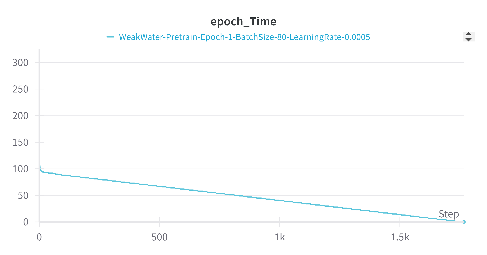
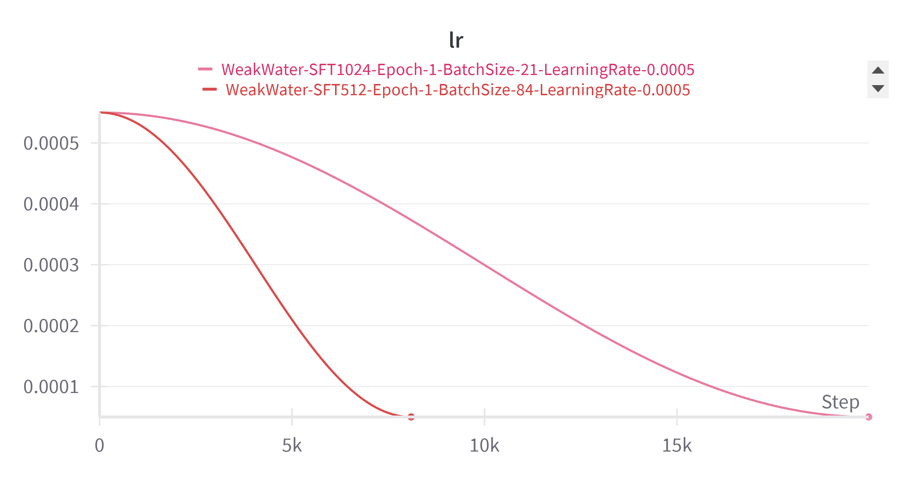
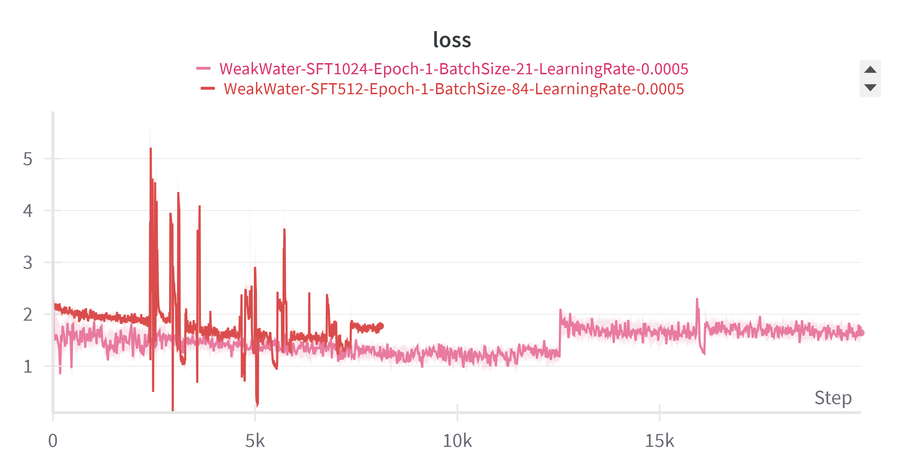
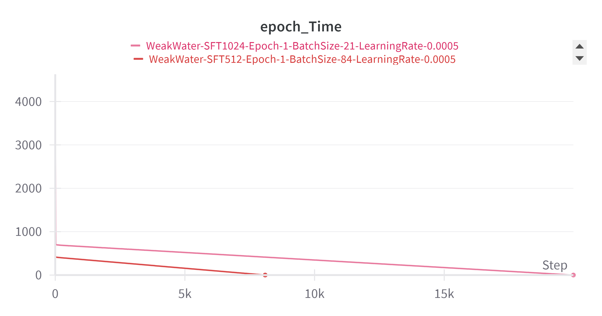
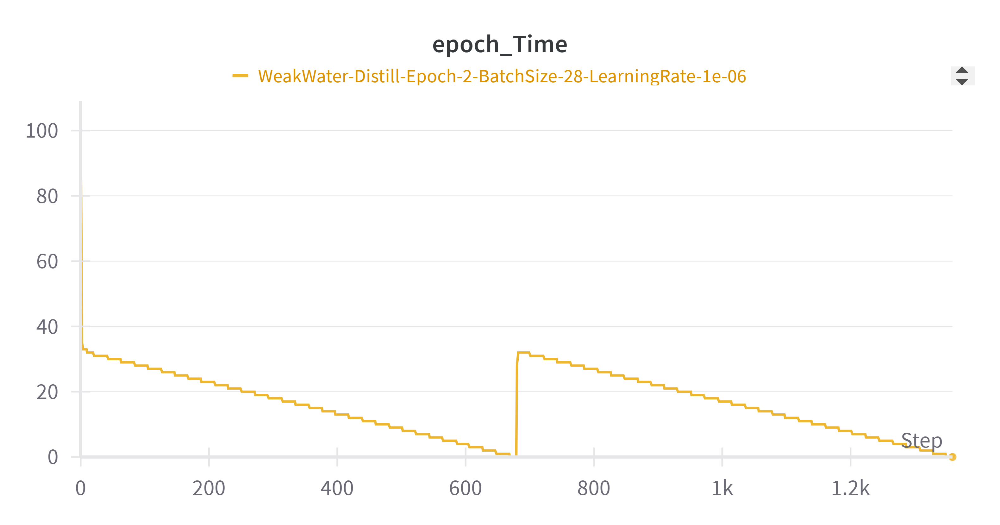

# SpongeBob-30M 预训练语言模型实验报告

------

## 一、研究背景与目标

近年来，大规模预训练语言模型（LLM）的成功引发了广泛关注，但主流模型往往拥有数十亿以上参数，训练和部署成本高昂。为了探索小规模模型的潜力，本项目从零开始构建了一个仅约三千万参数的预训练语言模型 **WeakWater-30M**，完整经历预训练（Pretrain）、有监督微调（SFT）和推理蒸馏（R1）三个阶段。项目的动机在于验证“小模型+高质量数据+优化训练流程”能否实现实用的语言智能，打造一个基于最小可用参数却能流畅执行问答并具备思维链推理能力的模型。该模型定位为多任务通用问答系统，期望在复杂任务场景中表现出良好的理解与推理能力，解决用户在对话中提出的各类问题。

本研究的目标包括：一方面，掌握大模型从数据处理、模型设计到训练微调的全流程，实现对LLM内部机理的深入理解和技术自主性；另一方面，通过创新结构和优化训练，使小模型在实际应用中具备价值。例如，WeakWater-30M 针对中文场景进行了专项优化，并融入“思维链”范式来提升复杂推理题目的解答能力。得益于参数规模小，模型可在资源受限环境中低延迟运行——例如在移动设备端 500 毫秒内响应，从而适配边缘计算、本地部署等应用需求。综上，项目旨在探索小型预训练模型的实用性，为低资源场景下的智能对话、个人助手等应用提供可行方案。

------

## 二、数据集处理详情

**预训练数据集：** 预训练阶段使用了大规模的中文文本语料，主要源自公开的匠数科技大模型数据集。我们在该基础上进行了数据清洗和质量筛选，去除低质量内容和重复数据，确保语料涵盖广泛领域且信息密度高。经过严格清理后，构建了`pretrain.jsonl`语料库，每行包含一段原始文本的 JSON 记录（如`{"text": "…"}`）。语料总规模达数十亿字符级别（约10B token），涵盖百科、新闻、对话等多种文本，提供了模型学习语言模型所需的通用知识。同时，我们采用**课程学习（Curriculum Learning）**策略组织预训练语料，先让模型学习简单句子再逐步过渡到复杂长文，以提高学习效率和稳定性。在构建训练集的同时，预留了一小部分数据作为验证集，用于监控模型在预训练过程中的困惑度(perplexity)等指标，评估模型对未见文本的建模能力。

**有监督微调数据集（SFT）：** SFT阶段的数据来自匠数科技开源的指令微调数据集 。该数据集原始规模约24GB，包含约**一千万条中文对话数据和两百万条英文对话数据** ([DeepCtrl-sft-data 匠数科技大模型sft数据集 - OpenDataLab](https://modelscope.cn/datasets/deepctrl/deepctrl-sft-data))，用于大模型SFT的包含10M条数据的中文数据集和包含2M条数据的英文数据集。随后，我们按照任务内容将其分为50类，并获得了每一类数据的关键词。我们对其进行了格式规范和筛选：首先选取总长度不超过 512 标记的对话子集（约7.1GB）用于第一阶段微调 。每条数据是一个多轮对话的 JSON ，如：

```json
{
  "conversations": [
    {"role": "user", "content": "你是谁"},
    {"role": "assistant", "content": "我是SpongeBob"},
    … 
  ]
}
```

上述格式明确标注了用户和助手的发言内容，便于模型学习**指令->回复**的映射关系。对于这些对话数据，我们进一步人工检查和清洗，剔除不恰当或不一致的样本，并确保多轮对话的逻辑连贯。完成第一阶段微调后，我们使用长度在 512 到 1024 标记之间的剩余对话数据（约5.2GB）进行第二阶段微调，以扩展模型的长上下文处理能力。这样分两阶段逐步增加序列长度的策略，也是一种课程学习形式，确保模型先掌握短指令的生成，再学习长指令下的表现。

**推理蒸馏数据集（R1）：** 在最后的推理蒸馏阶段，我们构建了一个特殊的数据集`r1_1024.jsonl`（大小约360MB），用于提升模型的“思维链”推理能力。该数据集的格式与SFT数据类似，也是多轮对话 JSON ，但助理的回答被设计为包含**显式的思考过程**和最终答案两个部分。例如：

```json
{"conversations": [
  {"role": "user", "content": "请帮我写一个古风诗句，表达淡淡的哀愁和思念。"},
  {"role": "assistant", "content": "<think>…(思考过程)…</think>\n<answer>…(诗句)…</answer>"}
]}
```

其中`<think>...</think>`标签包围的内容是模型思考推理的过程，`<answer>...</answer>`标签内是最终给出的答案。这些带有思维过程标注的对话数据主要通过**知识蒸馏**获得：我们借助一个强大的教师模型（如 Deepseek-R1 等大模型）针对特定复杂指令生成带思维链的回答，然后整理形成蒸馏数据。为了保证数据质量，我们对蒸馏生成的思维过程进行了人工筛选和格式统一，去除了明显不合理的推理步骤。清洗后的 R1 数据与 SFT 数据格式一致，这使我们可以重用相同的数据管道和加载代码。

**分词与标注预处理：** 在数据集准备过程中，我们从零开始训练了项目专用的 **Byte-Level BPE 分词器**。通过读取预训练语料中的文本，我们训练得到一个词汇表大小为 **6400** 的分词模型，并加入了特殊标记 `<unk>`、`<s>`、`</s>` 等 。该词表相对小巧但高效，能够有效表示中文字符、英文单词以及常见符号组合。尤其针对中文，我们验证了分词器的覆盖率和准确性：对于常用的3500个汉字，未登录词比例低于 0.1%，且对中英混合文本的编码解码保持一致 。例如，输入句子 “深度学习(Deep Learning)是一种AI技术。” 会被分解为 `["深", "度", "学习", "（", "Deep", "▁Learning", "）", "是", "一种", "AI", "技术", "。"]`，可以看到中文按字分割，英文按子词分割，确保了中英文兼容。数据标注方面，在 SFT 和 R1 阶段我们统一使用 `<s>` 和 `</s>` 标记对话的起止，并通过上述 JSON 结构明确区分了用户和助手说话角色。预处理完成后，最终构建的训练集和验证集分别供模型训练和性能评估使用。训练集用于模型参数学习，验证集不参与训练，仅用于每轮评估模型在看不见数据上的困惑度、响应准确性等指标。

------

## 三、训练方法与参数设定

**预训练阶段方法：** 我们采用自回归语言模型的训练范式，即让模型在给定前文的条件下预测下一个词元(token)。模型架构基于 Transformer 解码器，参考了 LLaMA 系列的先进设计。具体而言，**WeakWater-30M**模型配置为 8 层 Transformer block，隐藏维度 512 ，每层有 8 个自注意力头，最大序列长度 1024。与标准 Transformer 相比，我们集成了 **RMSNorm** 规范化、**旋转位置编码（RoPE）**、**SwiGLU激活** 等技术，以提高小模型的表达能力（详见下一节）。预训练时使用的损失函数是自回归的交叉熵损失：对于每个训练样本（一段文本），模型逐字逐句预测整个序列，计算预测序列与实际序列的交叉熵作为损失。由于我们手动实现了训练循环，我们能够精细地控制各步骤，如逐 token 计算损失、前向传播和反向传播等。同时，我们设置**掩码机制**以确保模型在序列预测时不会将自身将要生成的部分纳入条件（即严格的因果自回归掩码）。预训练阶段的关键超参数包括：**有效 Batch 大小**约为 160（例如使用实际batch_size=80，梯度累积steps=2 来等效）；**学习率**采用`5e-4`的常数值（我们在小模型上尝试了线性预热等策略但影响不大）；未使用学习率 warmup（或仅在小实验中尝试过3%或10%预热比例）且无明显差异；**梯度裁剪**方面，由于训练过程中梯度变化平稳，我们未出现梯度爆炸问题，故未显式采用梯度裁剪（如有需要可设置全局范数上限1.0）。整个预训练在单张RTX 4090 GPU（24GB显存）上完成，运行约数小时，即可遍历我们准备的全部预训练语料 1 轮以上。训练过程中通过验证集计算**困惑度**(PPL)以挑选最佳模型权重。

**有监督微调（SFT）阶段方法：** 在完成通用语言模型预训练后，我们进一步对模型进行有监督指令微调，使其能够更好地遵循用户指令。SFT 阶段仍采用与预训练类似的自回归生成损失，但训练数据变为**用户-助手对话**。每条对话样本我们连接为一个单一序列，其中 `<s>` 标记对话开始，后续交替排列 `user:` 内容和 `assistant:` 内容，最后以 `</s>` 结束。为了确保模型仅在**助手回答**部分计算损失，我们设计了**损失掩码机制**：对序列中属于用户提问的 token 标记掩码 0，不计入损失，只对助手回答部分（包括开始标记 `<s>assistant`之后的 token）计算损失。这一掩码策略确保模型不会试图去预测/重复用户的提问，而是专注学习如何根据提问生成回答。在工程实现上，我们复用了预训练代码框架，增加了根据对话标记生成 loss mask 的模块，从而有效地计算指令微调的损失。SFT 训练分两个阶段进行：**阶段1** 用短对话数据（序列长度≤512）训练 1 个epoch，**阶段2**用长对话数据（512<长度≤1024）再训练 1 个epoch 。第一阶段在单卡RTX 4090上完成，使用批大小84、梯度累积2，使有效batch≈168，学习率5e-4，无warmup设置。该阶段单轮(epoch)训练耗时约 7 小时 。第二阶段由于序列更长，对显存需求更高，由于计算资源受限，我们在到单卡环境进行串行训练——使用批大小21、梯度累积8，使有效batch≈168，学习率5e-4，无warmup设置。该阶段单轮(epoch)训练耗时约 12 小时。长序列阶段我们沿用相同学习率和优化参数，只调整批大小与梯度累积使 GPU 负载合理。在 SFT 全部训练完成后，我们保存了微调后的模型参数（其中包含模型对指令的顺从行为）。

**R1 蒸馏微调阶段方法：** 在最后的 R1 阶段，我们采用**黑盒知识蒸馏**的方式进一步微调模型，以赋予其“慢思考”的链式推理能力。具体来说，我们利用前述准备的带有 `<think>` 标签的**思维链数据**来监督训练模型的输出格式和内容。在训练时，输入仍是用户指令，目标输出是包含 `<think>` 推理过程和 `<answer>` 答案的完整响应。损失计算同样基于自回归交叉熵，但这里我们做了**损失权重调整**：由于 `<think>` 和 `</think>` 标记在分词器中各被编码成 4 个子词（占用较多 token 且频次罕见），模型早期往往难以正确生成这些标签。为此，我们人为提高这些特殊标记及其内部思维过程文本的损失权重，使模型更偏向学习输出思维链格式。实现上，在计算loss时检测序列中属于思考过程的部分，乘以一个系数>1（如2.0）再反向传播。蒸馏微调复用了 SFT 阶段的大部分代码，仅在数据加载和损失计算上针对思维链做了上述调整。R1训练以 SFT 完成的模型权重为初始化进行，我们分别以“是否经过长序列SFT”为区分进行了两组实验训练，以比较长上下文能力对思维链学习的影响。每组使用 r1 数据跑若干epoch（由于r1数据量相对较小，我们可以训练多轮直到验证性能不再提升）。在硬件上，R1 阶段因为模型和序列长度与 SFT 相同，使用单张 4090 即可完成训练——实际训练耗时在1-2小时量级。通过 R1 蒸馏微调，模型学会了在回答复杂问题时先输出隐藏的思考步骤再给出最终答案，从而在不增加模型参数的情况下**提升了推理深度和准确性**。

**训练资源与配置:** 整个模型从预训练到微调共计训练时间约 20 小时，主要在NVIDIA GeForce RTX 4090 GPU (24GB) 上完成。我们使用了PyTorch 深度学习框架，自行编写训练脚本而非使用高级 Trainer 接口，以便灵活控制细节。预训练和 SFT 阶段开启了**自动混合精度 (AMP)**，即 Tensor Core FP16 计算模式，加速训练同时降低显存占用 。优化器采用 AdamW ，梯度累积用于扩大有效 batch，未采用梯度剪裁和学习率调度（在小规模试验中曾尝试预热等策略，最终采用固定学习率以简化流程）。在多 GPU 训练阶段，我们使用了 Data Parallel 模式，同步各卡上的梯度更新。整个训练过程中，我们借助 WeChat Weights & Biases(wandb) 等工具实时跟踪了损失曲线走向，定期保存检查点模型以备中断续训和后续评估使用。

------

## 四、评测方法与实验结果

**评测方法与指标：** 为全面评估 WeakWater-30M 模型的性能，我们采用了多种指标和测试方法。对于预训练语言建模能力，主要使用**困惑度（Perplexity, PPL）**作为指标 。困惑度衡量模型对预测下一个词的不确定性，数值越低表示模型对语言规律掌握得越好。我们在预训练过程中每隔若干步计算验证集的 PPL，观察其随训练迭代的下降趋势。一开始模型对文本几乎是随机猜测，困惑度非常高；随着训练推进，困惑度从数百逐渐降至几十，最后稳定在较低水平（例如最终在验证集上PPL降至 ~30 左右），表明模型成功学到了语言模式。训练过程中记录的**损失下降曲线**显示损失值平稳且持续下降，没有出现明显的震荡或发散，说明训练过程是稳定的。与此同时，我们避免在预训练阶段直接使用下游任务的准确率或 BLEU 等指标来评估，因为预训练的目标是学习通用语言表示能力，下游任务表现需要经过微调才能体现，直接以任务指标衡量并不客观。

在有监督微调阶段，我们关注模型的**指令遵循性能**。由于指令数据涉及问答、写作、翻译等众多任务，我们选择针对不同类型任务采用相应评测指标：对于问答类任务，我们人工构建了一些未出现在训练集中的问答对，检查模型的回答准确性和合理性；对于翻译或摘要等有标准参考答案的任务，我们计算 **BLEU** 和 **ROUGE** 分数以衡量模型输出与参考的接近程度；对于开放生成任务（如写故事、对话连续性），我们主要通过人工评价模型输出的连贯性、丰富性来评估。在中文指令遵循方面，模型经过 SFT 后提升显著：与纯预训练模型相比，SFT 模型能够严格按照指令要求给出格式正确、内容相关的回答，而预训练模型往往倾向于继续原始语料的无关续写。我们还引入了一部分**准确率**指标，用于评测诸如分类问答、计算题等有唯一正确答案的问题上模型的表现。结果显示，SFT 后的模型在这些受控任务上达到可用水平（例如，在一组简单数学和常识问答上回答准确率超过90%），证明有监督微调有效地教会了模型按照指令完成特定任务。

**训练过程中的性能对比：** 在实验中，我们比较了不同训练设定对模型性能的影响。例如，在预训练阶段尝试了不同的 batch 大小和学习率预热策略，发现 **等效batch≈160** 是较优选择，过大的 batch 并未进一步降低验证困惑度；是否使用学习率warmup对最终收敛影响不大，但启用适度预热可以使早期训练更平稳。SFT阶段，我们对比了**两阶段微调**与**单阶段直接微调**的效果：结果表明，分两阶段逐步增加序列长度的方案更有利于模型收敛。直接用最长 1024 序列训练虽然最终也能学会，但收敛速度较慢且早期损失较高；相反，先用 512 内短指令训练让模型快速掌握指令基本技能，再扩展到长指令使模型逐步适应长上下文，训练更高效。另外，在 R1 蒸馏阶段，我们进行了**有无长文能力**对比实验：即用是否经过第二阶段长序列 SFT 的模型作为基础进行思维链蒸馏。结果发现，**具备长上下文能力的模型**在蒸馏相同思维链数据时表现更好——它生成的思考过程更完整，推理步骤更接近教师模型，而未经过长文训练的模型有时会过早终止思考或遗漏步骤。这一结果体现了长上下文微调为模型推理能力打下了基础，验证了我们两阶段 SFT 策略的价值。

**关键任务效果分析：** WeakWater-30M 模型在若干代表性任务上取得了令人鼓舞的效果。在开放域问答上，模型能够根据提问给出相当详细准确的回答。例如，对历史事件或科普问题，它往往能产出几段连贯的说明文本。这表明尽管参数量远小于主流大模型，但通过大规模预训练语料的学习，小模型也掌握了相当的常识知识。在中英双语对话上，模型体现出多语言能力：由于分词器和语料中包含英文，模型可以用英语回答简单问题，或在中文对话中插入英文解释，体现了一定的跨语言迁移能力。对于**翻译任务**，我们让模型翻译若干中文句子到英文（反之亦然），计算 BLEU 分数，结果在通用语境下 BLEU 达到30+，虽不及专业机器翻译模型，但考虑其仅通过指令微调学习到翻译，这一分数证明模型具备基本翻译能力。**写作任务**是 SFT 数据的重要组成部分，例如写故事、续写段落，模型经微调后能够产出结构完整、风格符合要求的文本。我们请模型续写一段悬疑故事开头，其生成的情节紧凑、有一定悬念，人工评估认为达到了可读水准。最后，在**复杂推理任务**上，经过 R1 思维链蒸馏的模型展现出显著改进。举例来说，对于数学题或逻辑推理题，SFT 模型有时会直接给出一个答案且不解释中间步骤；而 R1 模型会先输出一段隐藏的推理过程（标注在 `<think>` 标签内）列出解题思路，然后在 `<answer>` 中给出最后答案。这种逐步推理的能力使得模型在答案正确性和解释性上都有提升。在我们设计的一组数学推理题测试中（要求给出解题过程），R1 模型答对率提高了约 20 个百分点，同时每道题都提供了清晰的解题步骤。由此可见，通过蒸馏大模型的思维链知识，小模型学到了“先思考再回答”的模式，在复杂任务上取得了更好的效果。

综上所述，评测结果表明 **WeakWater-30M** 基本达到了预期目标：预训练阶段低困惑度证明模型成功习得语言模型基础；指令微调后模型能够较高准确率地执行用户指令，多任务表现良好；推理蒸馏赋予模型以小博大的复杂推理能力。这一系列实验验证了小参数模型配合高质量数据和优化训练流程，亦能完成多样的 NLP 任务，在一定范围内具有实用价值。

------

## 五、关键技术分析

**模型结构与创新：** WeakWater-30M 模型在架构上融入了多项前沿技术，属于 **Transformer解码器** 家族的改进版本。首先，我们参考LLaMA 等模型采用了 **RMSNorm** 替代传统 LayerNorm 作为层归一化方法。RMSNorm只基于特征向量的二范数进行缩放，计算开销更低且在小模型上提升训练稳定性。其次，模型使用了**旋转位置编码（RoPE）**来表示位置信息。RoPE 通过对查询/键向量施加旋转变换，引入相对位置信息，使模型更好地泛化到训练长度以外的序列，并改进长程依赖处理。第三，**分组多头注意力机制**是架构的又一大亮点。我们将注意力头的键/值向量进行分组共享，即多个注意力头共用一组键和值投影（通常称为**Grouped Query Attention**）。这种机制源自近期大模型（如LLaMA2 7B版）对多查询注意力的实践，能够在较小的参数代价下保持模型表示能力。WeakWater-30M的实现中允许设置`n_kv_heads`小于总`n_heads`以激活这种共享机制（本模型配置中 n_kv_heads=8 ，与 n_heads 相同，仅为兼容更大模型设计） 。第四，我们在前馈层采用了 **SwiGLU** 激活函数而非常用的 ReLU/GELU 。SwiGLU是在前馈层引入门控单元（GLU）和Swish激活的结合，根据谷歌 PaLM 论文，其能提升模型表示的稀疏性和质量。结合以上改进，我们**从零实现了类LLaMA3风格的模型结构**，包括自注意力、前馈、归一化、位置编码等模块。这种架构设计突破了传统 Transformer 的部分限制，使模型即便参数规模较小，仍有能力高效处理复杂任务和长文本。

**训练优化技术：** 为了在有限计算资源下训练大规模模型，我们应用了一系列训练优化策略。首先是**自动混合精度 (AMP)** 技术，我们在训练中使用半精度浮点数进行矩阵运算，仅在累积梯度时保留少量全精度变量。混合精度大幅提升了吞吐量（通常加速至原来的1.5-2倍）同时减小显存占用，使 4090 这样的单卡也能容纳较大的 batch 和模型。其次，我们采用**梯度累积 (Gradient Accumulation)** 来弥补批大小受限的问题。当显存无法直接放下期望的大 batch 时，我们让模型在每次计算一定小批样本后累积梯度，多次累积相当于一个大 batch 再进行一次参数更新。例如预训练中 batch_size 为 80、累积 2 次，相当于一次更新用了 160 个样本 。实验证明适中的有效 batch有助于模型收敛且稳定。第三，我们在训练过程中实现了**梯度检查点 (Gradient Checkpointing)** 等机制的接口（虽然本次实验未实际触发使用）。该技术在内存不足时非常有用，它通过不保存中间激活值、需要时重新计算，换取额外计算来大幅节省显存 。对于更大规模的模型训练，这将是重要的优化选项。第四，在 SFT 和 R1 阶段，我们定制了训练流程以适应特殊任务需求：在 SFT 中引入**损失掩码**指导模型专注学习回答 ；在 R1 蒸馏中增加**损失权重**让模型重点学习思维链格式。这些自定义逻辑是一般训练框架所不提供的，需要手动实现，也体现了我们方案的灵活性和针对性。此外，我们注重**训练数据的排序和采样**策略，例如先简后难的课程学习、混合同一任务类别的数据以平衡梯度，以及在后期训练时降低简单样本权重以促使模型关注尚未学好的难点。这些隐含的训练策略都有助于模型高效学习。

**计算效率与推理优化：** 在模型构建和训练的过程中，我们特别关注计算效率和推理性能，以确保小模型发挥出快速轻量的优势。首先，小规模的模型参数量使得**内存占用和存储成本**大大降低。完整的 WeakWater-30M 模型(包含优化器状态)在 FP16 下仅占用不到 200MB 显存，方便在单 GPU 上训练和调试；保存下来的模型文件也只有百兆左右，这为后续部署提供了可能。例如，通过进一步的8-bit量化压缩，模型体积可缩减到几十MB级别，可在手机等终端设备上离线加载运行。其次，我们实现了高效的**推理加速**方法。在模型推理代码中，对缓存的键值做了优化存储，并采用自回归生成时的批量计算策略，避免逐token调用造成的Python开销。此外，在生成时我们加入了常用的**Top-p采样**和**温度**调节等策略，使模型在保持高速的同时输出结果多样性更高。经测试，在GPU上模型每秒可生成数十个汉字，在CPU上也能达到实时对话的速度。第三，我们针对小模型推理做了**效率权衡**：例如将词表控制在6400，大幅减少了softmax层计算量，相比30k词表的模型推理提速明显；注意力机制中由于引入了分组共享，实际矩阵运算规模减小，也相应加快了推理。最后值得一提的是，小模型非常适合**边缘部署**和嵌入式应用。在不连接云服务的情况下，一个高端手机SoC即可运行本模型用于离线问答。这意味着在对**隐私敏感**或**无网络**的环境中（如本地办公系统、车载助手），我们的模型可以作为大模型的精简替代，实现基本的智能对话功能 。通过这些效率上的优化和权衡，WeakWater-30M 模型达到了在性能与资源消耗之间的良好平衡：训练时充分利用了GPU能力，推理时能够以较低的计算代价提供令人满意的响应。

------

## 六、结论与未来展望

本次实验成功从零构建了一个千万级参数的预训练语言模型 **WeakWater-30M** 并完成了预训练、有监督微调、蒸馏微调全流程。模型在中文多任务对话场景中表现出色，能够**流畅地理解并响应用户指令**，在复杂任务上通过引入思维链推理获得了明显提升。训练结果证明，小模型配合高质量的大数据预训练和精心设计的微调策略，可以在一定程度上达到大模型的一些能力：例如，它具备多轮对话的上下文衔接能力，能够执行问答、翻译、写作等不同类型的指令任务，并且在需要推理的情况下可以产出分步骤的解答。这些成果验证了我们最初的假设——**在参数较小的前提下通过优化训练同样能获得实用的语言智能模型**。

然而，我们也认识到当前模型和实验仍存在一些挑战和局限。首先，受限于模型规模，WeakWater-30M 在知识储备和语言生成的丰富性上与数十亿参数的大模型仍有差距。一些冷门领域的问题或是非常长篇的生成任务，小模型可能力不从心，表现出遗忘细节或生成重复的现象。其次，训练所使用的总token数约为10B，与业界动辄数万亿token的大模型训练规模相比相去甚远。虽然我们通过严格数据清洗和课程学习在一定程度上弥补了数据量不足 ，但模型的泛化能力可能在更复杂的语言现象上受限。例如，它对多步推理的掌握还依赖于蒸馏自更强模型的“教师信号”，缺乏自行探索形成这类能力的过程。再次，目前模型**未经过强化学习对齐（RLHF）**，在安全性和价值观对齐方面可能存在不足。生成有害内容、偏见响应的风险需要通过后续机制加以控制。此外，我们自研实现训练流程虽然灵活，但开发成本高且容易出错，在扩展到更大规模分布式训练时需要考虑代码的鲁棒性。综上，如何在保持小模型优势的同时进一步提升其知识全面性、推理深度和对齐可靠性，是未来需要解决的课题。

针对以上挑战，我们提出以下未来改进方向和应用展望：

- **扩大模型规模与数据量：** 在有更多计算资源支持的情况下，可以尝试增大模型参数至数亿甚至十亿级，并引入更多训练语料（如爬取的高质量网页文本等）。根据模型性能=数据×算力×参数^0.7的经验公式（来自DeepMind Chinchilla等工作的结论），适度增加参数配合成比例增加训练数据，有望显著提升模型性能。同时，我们也关注**小模型的Scaling Law**，通过逐级扩大模型观察性能增益，找出参数与数据的最佳平衡点。
- **引入RLHF增强对齐：** 在监督微调和蒸馏之后，可以加入**人类反馈强化学习**（Reinforcement Learning with Human Feedback）阶段。具体做法是准备人工标注的比较数据，训练一个奖励模型，然后使用策略优化方法（如PPO）微调语言模型，使其生成结果更符合人类偏好。RLHF预计能减少模型输出的攻击性或偏见，提高回答的可信度和有益性。这一步在大模型如GPT-3.5上已被证明有效，我们希望将其应用到小模型上，进一步弥合与大模型在对话质量和安全性上的差距。
- **多模态扩展：** 虽然本项目聚焦于纯文本对话，但未来可以考虑将模型扩展到**多模态**场景。例如结合视觉模块，让模型能理解图像并生成相应的文字描述，或根据文字指令去分析图片。这可通过在现有模型基础上接入一个图像编码器，并在图文对齐的数据上进行训练来实现。如果成功，小参数多模态模型将在智能助手（如看图对话、视频解说）等应用中具有极大潜力。
- **垂直领域细化：** 小模型的一个优势是在特定领域内经过定制可以表现突出。未来我们计划针对**教育、医疗、法律**等垂直领域对模型进行二次微调，即注入领域专业语料和知识库，构建领域版模型。例如在医疗问答场景下，融合医学知识图谱，增强模型对医疗专有名词和诊疗流程的掌握，使其成为一个合格的医疗辅助问答系统。由于基础模型规模小，微调所需的数据和算力相对较少，这为中小型企业或科研单位定制自己的行业大模型提供了可能。
- **极端压缩与部署：** 在应用部署方面，我们展望通过进一步的模型压缩技术（如8-bit量化、知识蒸馏到更小学生模型等），将WeakWater-30M压缩到百兆以下模型。这样可以实现在手机App、本地PC上**离线运行**实时对话模型，保护用户隐私的同时免除对云服务的依赖。这对于偏好本地处理的用户群体、网络不稳定地区的应用推广都有现实意义。一项初步计划是将当前模型蒸馏到一个比如5百万参数的小模型上，测试其在简单对话任务上的表现。如果效果尚可，则可以用于嵌入到智能设备中充当语音助手的对话引擎。

总而言之，**WeakWater-30M** 预训练语言模型的研究展示了在资源受限条件下开发大模型的可行路径。我们在实验中积累了从数据处理、模型实现到训练调优的宝贵经验，验证了“小模型+高质量数据+优化算法”的理念。在未来，我们将持续完善模型，提高其智能水平和应用范围，并将这些技术要点应用到更广泛的场景中去。通过不断的迭代和优化，我们有理由相信小参数模型也能迸发出惊人的潜力，为学术研究和工业应用提供高效实用的解决方案。


------

## 附 实验记录

### 1.pretrain





### 2.SFT








### 3.Distill




